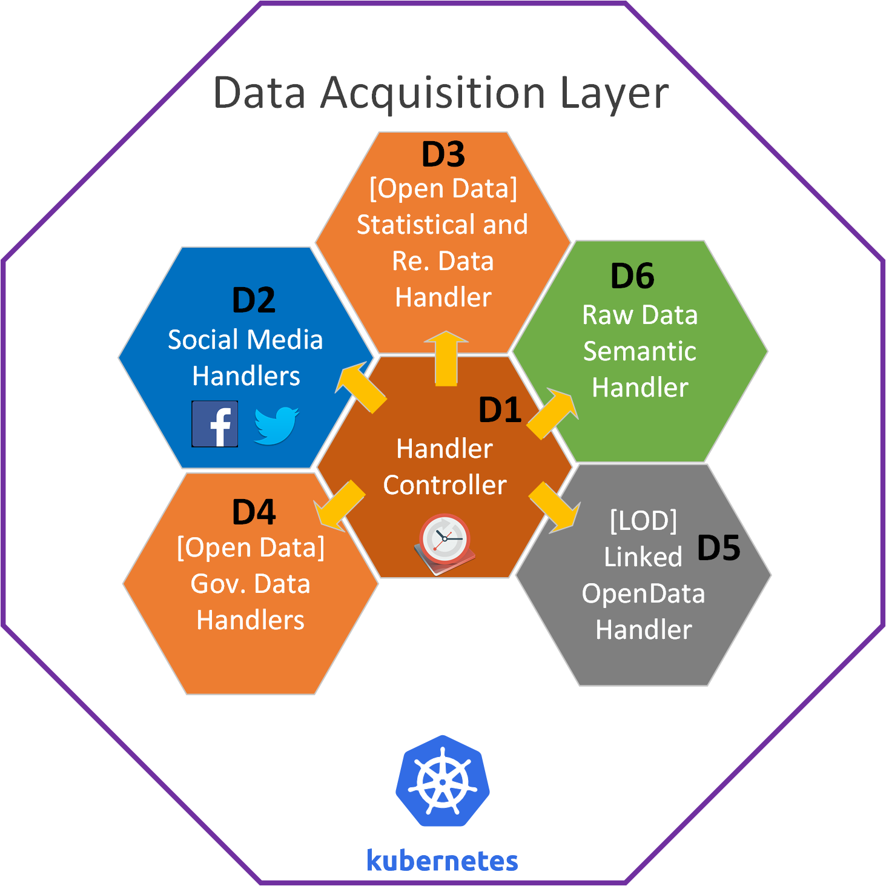

# **D1 - Handler Controller**

## Description

For the collection of the various Web Sources described in deliverable D4.1, a Handler Controller (HC) will be used for spawning all the needed data acquisition containers. These containers would suffice the needs of D2 – Social Media Handlers, D3/4 Open Data/Statistical, Research and Governmental Data and D6 – Raw Data Semantic Handler. The Handler Controller is used in conjunction with a supportive Redis Cache and its responsibility is to feed it with all necessary keys and tokens that are then used by the different Handler Containers to fetch data from the specified external sources. The full description of the Handler Controller is included in deliverable D4.1

The HC acts as an orchestration medium for the multiple data collection handlers. It spawns itself after a specific time interval, currently configured to occur daily, and it performs the following:
1.	It confirms that the following are up and running:
-	Docker/Kubernetes instance
-	Redis Cache
-	ElasticSearch Instance
2.	Administration and validation checks on the handlers’ orchestration infrastructure. This is performed using the Docker CLI command line tool. The HC runs a specific list of commands to identify whether the docker containers that support components D2, D3, D4 and D6 are up and running. Logs are also observed as an extra medium of validation. The Bash script of the administration and validation checks is provided in the Git repository of the project.
3.	Spawns the Handler Data Collectors to start consuming data.
4.	Populates the Redis Cache with all necessary existing service OSN IDs and authentication keys that are then consumed by the data handlers.
The interaction between the HC and the other data handlers is depicted in the following figure. 
 

`This component is deployed as a CronJob that is automatically executed and does not have a dedicated service URL
. This repo will be periodically being updated to accommodate any new data acquisition layer module additions`

## **Contact**
If you encounter any problems, please contact the following:

## License

[Apache-2.0](../LICENSE)
