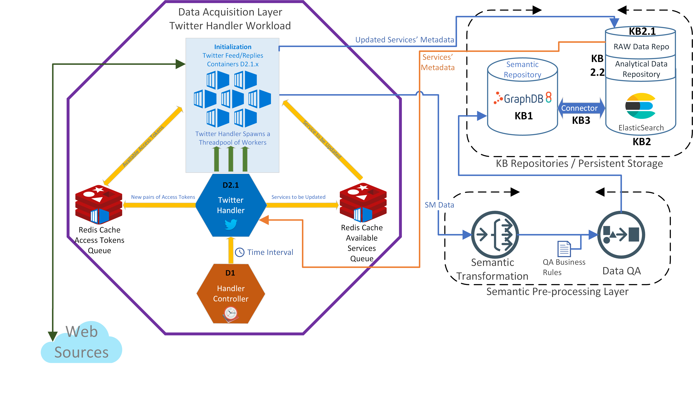

# **D2 - Twitter Handler**

The Twitter Handler implementation is based on the following diagram which is in-depth described in D4.2 and D3.4.



The Twitter Handler D2.1 is responsible to spawn its own thread-pool of workers and to populate the supportive Redis 
Cache with the access tokens and the identifiers of all registered Twitter accounts (screen_names and/or user_ids) of 
organization and services of the portal. 

Each thread-pool of workers communicates with the Redis Cache to fetch the access tokens of all the registered Twitter 
and Facebook accounts. The access tokens with the associated screen names (unique identifiers per social network) are 
then used for data retrieval. The retrieved data are then stored within the KB2.1 – Raw Data Repository.

**All tweets are also being semantically annotated by the Semantic Pre-processing Layer. This is accomplished using the 
LinkedPipes docker container provided by EVERIS [here](https://github.com/SoCaTel/semantic-preprocessing-pipelines).**

## Getting Started
### Prerequisites
* Prior following this guide please complete the guide found under the linked-pipes github repository. The semantic
 pipeline must be enabled for the semantic pre-processing to take place. 
* Elasticsearch, for direct queries to the database. For help in setting this up and the necessary Elasticsearch indices
, refer to [this](https://github.com/SoCaTel/elasticsearch-schema) repository.
* In addition please follow the guide found under the git repo [here](../handlercontroller). The guide 
provides all the necessary material to build the basic infrastructural components needed for the data handlers to work. 


## **Deployment**

### **Pre-checks**

First thing to confirm is that the RedisCache and the LinkedPipes are up and running, available 
[here](https://github.com/SoCaTel/semantic-preprocessing-pipelines). Do so using the following command

```
$ docker container ls
```

if the output is similar to the following then all necessary components are up and running. The `socatel-redis-ui` 
container is helper RedisCache UI module for debugging purposes.

```
CONTAINER ID        IMAGE                                                                  COMMAND                  CREATED             STATUS              PORTS                                                                                                                              NAMES
278997ea0460        .../linkedpipes:1.0                                                    "/bin/bash /lp/linke…"   19 hours ago        Up 18 hours         0.0.0.0:22210->22210/tcp, 0.0.0.0:32800->32800/tcp, 0.0.0.0:32810->32810/tcp, 0.0.0.0:32830->32830/tcp, 0.0.0.0:32850->32850/tcp   docker_linkedpipes_etl_1_cc1b10148d8b
ccb82ee5174c        redis:latest                                                           "docker-entrypoint.s…"   45 hours ago        Up 45 hours         0.0.0.0:6379->6379/tcp                                                                                                             socatel-redis
```

### **build_all.sh**

The `build.all.sh` is a helper Bash Script that will prepare all necessary images for this process. The following 
commands are run:

```bash
$ cd handler/loader
./docker_build.sh

cd ../../feed/
./docker_build.sh

cd ../replies/
./docker_build.sh

```
From the above the following images and container will be created. No containers will be started during the build process
* `socatel/socatel-loader:latest` image and `socatel-loader` container. The socatel-loader container is responsible to 
communicate with the ElasticSearch Instance and populate the RedisCache `twitter_feed_services` and 
`twitter_replies_services` list queues
* `socatel/sct-twitter_feed:latest` image and `sct-twitter-feed-TH-1`, `sct-twitter-feed-TH-2` containers. These 
containers are responsible to fetch Tweets of organisations' and services' Twitter Accounts. The Twitter Account 
metadata are read from the previously populated RedisCache List Queues.
* `socatel/sct-twitter_replies:latest` image and `sct-twitter-replies-TH-1`, `sct-twitter-replies-TH-2` containers. 
These containers are responsible to fetch Tweets of organisations' and services' Twitter Accounts. The Twitter Account 
metadata are read from the previously populated RedisCache List Queues.

`THREADPOOL_SIZE` within each `docker_build.sh` is a predefined variable that sets the desired thread-pool size for the 
Twitter Feed/Replies thread-pool of workers

### **twitter_handler.sh**

The following bash script will initiate the above explained procedure. In detail all previously mentioned containers 
will start. The `THREADPOOL_SIZE` must be the same used as above

```bash
#!/bin/bash

FEED_CONTAINER_NAME=sct-twitter-feed
REPLIES_CONTAINER_NAME=sct-twitter-replies

# Initial Threadpool size
THREADPOOL_SIZE=2

echo "======================================================================="
echo -e "\t \t STARTING TWITTER HANDLER"
echo -e "** to observe logs of a container type $ docker logs \$container_name"
echo "======================================================================="

# STARTING twitter loader that loads all services to REDIS Cache
echo "Starting sct-twitter-loader"
docker start sct-twitter-loader
echo "sct-twitter-loader STARTED SUCCESSFULLY"

# Start docker container for twtter feed and replies
for thread_item in `seq 1 $THREADPOOL_SIZE`
do
  echo "Starting $FEED_CONTAINER_NAME-TH-$thread_item"
  docker start $FEED_CONTAINER_NAME-TH-$thread_item

  echo "Starting $REPLIES_CONTAINER_NAME-TH-$thread_item"
  docker start $REPLIES_CONTAINER_NAME-TH-$thread_item
  
done

echo "Twitter Handler Container is now completed"
```

After this script is called the Twitter Feed/Replies Handlers start working and consumed Tweets are then being sent
 to the ElasticSearch instance [`kb_twitter_raw` index] for raw storage and also in the semantic-preprocessing
  pipeline mentioned above.

The full detailed methodology on the feed and replies containers work are in the next section

### **Data Flow**
1.	The Handler Controller (D1) spawns the handler D2.1 as soon as it wakes (after a time interval).
2.	D2.1 then communicates with Raw Data Repository (KB2.1) (`so_organisation` and `so_service` indexes) and queries
 to fetch all services that need crawling. The need for crawling a service is determined from the timestamp of the
  last performed crawling operation. 
3.	All selected services’ metadata are then returned to the handler D2.1.
4. D2.1 pushes the following to the Redis Cache queues:
     1. Redis Cache Available Services Queue: screen names of services to be crawled.
     2. Redis Cache Access Tokens Queue: access tokens to use for crawling new data from a queued service.
5.	The thread-pool of workers periodically checks the two Redis Cache queues for new services. The check is
 performed in an ACID form and thus atomicity, consistency, isolation and durability are guaranteed. 
6.	When the thread-pool encounters a new service to crawl in the queue, it uses a specific screen name and a pair of
 access tokens to fetch and collect data from the service.
7.	Once the crawling is completed, the thread-pool informs the KB2.1 with the updated timestamp of the handled
 services.
8.	The handler D2.1 sends the crawled data to the Semantic Pre-Processing Layer.
9.	Thread-pool goes back to Step 5 to check for new services to crawl. If no service names exist, the thread-pool
 workers sleep for a time interval and as soon as they wake the above procedure is repeated.

## **Contact**
If you encounter any problems, please contact the following:

[](mailto:info@cyric.eu)

## License

[Apache-2.0](../LICENSE)

## Acknowledgments

* [SoCaTel project](https://www.socatel.eu/)
* [Horizon 2020](https://ec.europa.eu/programmes/horizon2020/en)
